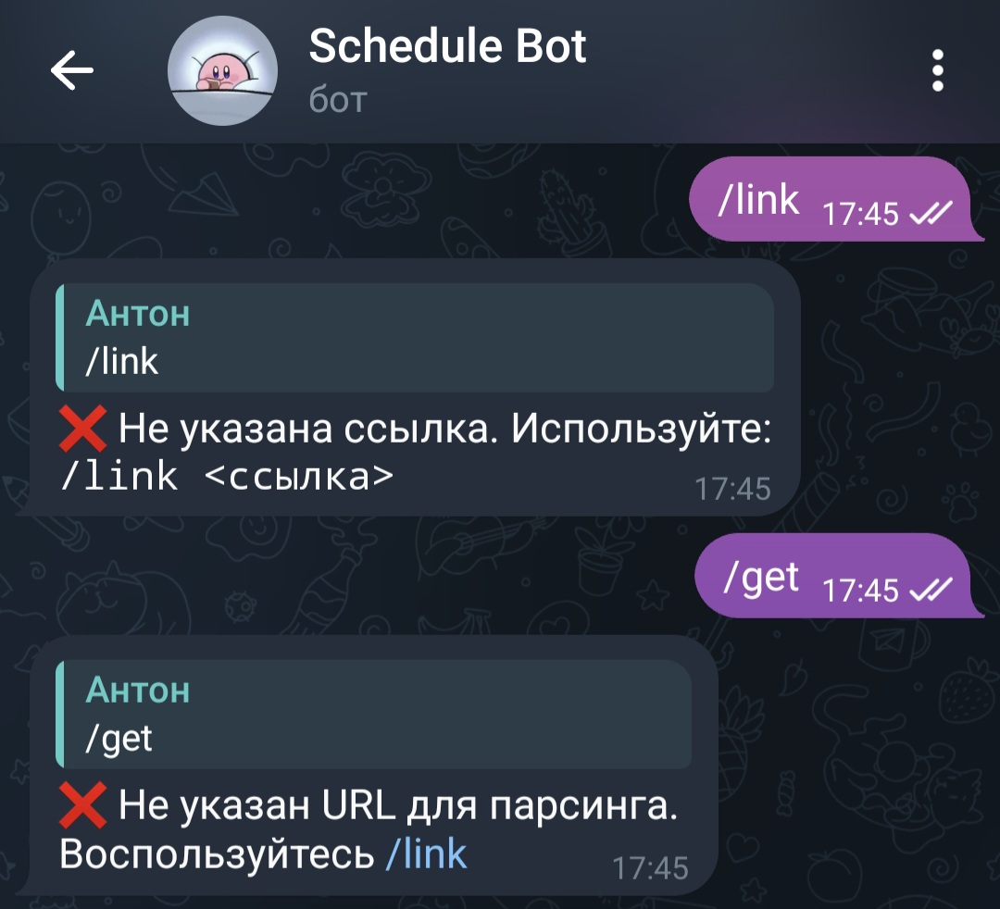
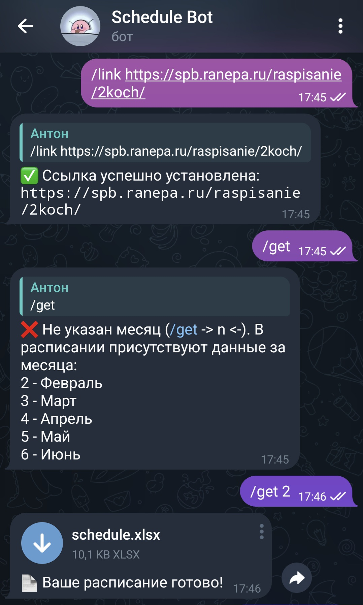

# 🤖 RANEPA Bot — Бот расписания для РАНХиГС (СПб)

Удобный Telegram-бот для получения актуального расписания студентов РАНХиГС в Санкт-Петербурге.  
Бот парсит данные с официального сайта и отправляет их в виде Excel-файла.

---

## 📌 Возможности

- ✅ Получение расписания по ссылке
- 🔗 Установка пользовательской ссылки на расписание
- 📅 Экспорт в Excel с фильтрацией по группам
- 🔄 Автоматические повторные попытки при ошибках сети
- 📂 Логирование действий и ошибок
- 🧠 Поддержка команд: `/start`, `/help`, `/get`, `/link`

---

## 🛠 Технологии

- Python 3.10+
- [PyTelegramBotAPI](https://github.com/eternnoir/pyTelegramBotAPI) — для работы с Telegram
- `pandas`, `requests`, `BeautifulSoup` — для парсинга и обработки данных
- `openpyxl` — для экспорта в Excel
- `dotenv` — для хранения токена бота
- `logging` — для ведения логов

---

## 🚀 Запуск бота

### 1. Клонируйте репозиторий

```bash
git clone https://github.com/ваш-ник/RANEPA-bot.git cd RANEPA-bot
```


### 2. Установите зависимости

```bash
pip install -r requirements.txt
```

> **Требования**: `telebot`, `pandas`, `requests`, `beautifulsoup4`, `lxml`, `python-dotenv`, `openpyxl`

### 3. Создайте `.env` файл

```env
env API_KEY=ваш_telegram_bot_token
```

Получить токен можно у [@BotFather](https://t.me/BotFather).

### 4. Запустите бота

```bash
python -m app.ScheduleBot
```

---

## 📥 Использование

| Команда           | Описание                                                                                      |
|-------------------|-----------------------------------------------------------------------------------------------|
| `/start`, `/help` | Показать справку                                                                              |
| `/get <n>`        | Получить расписание в виде Excel-файла `n`-го месяца                                            |
| `/link <url>`     | Установить ссылку на расписание, например:<br>`/link https://spb.ranepa.ru/raspisanie/2koch/` |


---

## 📁 Структура проекта

```shell
RANEPA-bot/
├── app/
│   ├── handlers/
│   │   ├── MainHandler.py
│   │   ├── ScheduleHandler.py
│   │   └── LinkHandler.py
│   ├── utils/
│   │   ├── ScheduleParse.py
│   │   ├── LoggerHelp.py
│   │   └── DateHelper.py
│   ├── ScheduleBot.py
│   ├── .env
│   └── config.py
├── output/
│   └── use_data.txt
├── LICENSE
├── req.txt
└── README.md
```

---

## ⚙️ Конфигурация

В `app/config.py` можно настроить:

- `GROUPS` — список групп для фильтрации
- `PARSER["FILE_PATH"]` — путь и имя выходного файла
- `PARSER["ATTEMPTS"]` — количество попыток парсинга
- `LINK["IS_SET"]` — работа с ссылками
- `LOGGER` - логгер бота'

---

## 💻 Пример работы

<table>
  <tr>
    
    
  </tr>
  <tr>
    
    
  </tr>
</table>

---

## 🔄 Обработка ошибок

- При таймауте соединения — автоматический перезапуск с экспоненциальной задержкой
- Все ошибки логируются в консоль
- Повторные попытки загрузки страницы (до 5 раз)

---

## 📝 TODO (возможные улучшения)

- [ ] Добавить поддержку нескольких групп через интерфейс
- [ ] Отправка расписания по дням недели
- [ ] Веб-интерфейс для управления
- [ ] Автообновление каждые N часов
- [ ] Добавление БД
- [ ] Стилистика

---